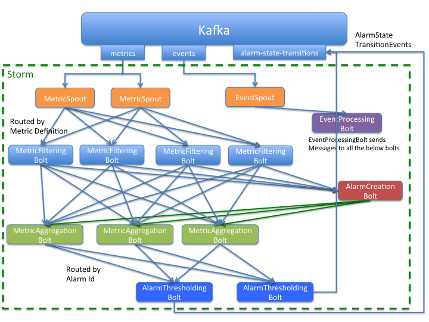

Team and repository tags
========================

[](http://governance.openstack.org/reference/tags/index.html)

<!-- Change things from this point on -->

monasca-thresh
==========

Monitoring Thresholding Engine

Computes thresholds on metrics and publishes alarms to Kafka when exceeded. The current state is also saved in the MySQL database.

Based on Apache Storm, a free and open distributed real-time computation system. Also uses Apache Kafka, a high-throughput distributed messaging system.



Alarms have three possible states: `UNDETERMINED`, `OK` and `ALARM`.  Alarms are defined by an expression that comes from the Alarm Definition. For example: 

```
avg(cpu{service=nova}, 120) > 90 or avg(load{service=nova}, 120) > 15
```

For more details on Alarm Definitions versus Alarms refer to the Monasca API documentation at https://github.com/openstack/monasca-api/blob/master/docs/monasca-api-spec.md.

If the expression evaluates to true, the Alarm state transitions to `ALARM`, if it evaluates to false, the state transitions to `OK` and if there aren't any metrics for the two times the measuring period, the Alarm state transitions to `UNDETERMINED`. Each part of the expression is represented by a Sub Alarm, so for the above example, there are two Sub Alarms.

The Threshold Engine is designed as a series of Storm Spouts and Bolts. For an overview of Storm, look at [the tutorial][storm-tutorial]. Spouts feed external data into the system as messages while bolts process incoming messages and optionally produce output messages for a downstream bolt.

The flow of Metrics is MetricSpout to MetricFilteringBolt to MetricAggregationBolt. The MetricSpout reads metrics from Kafka and sends them on through Storm. Metrics are routed to a specific MetricFilteringBolt based on a routing algorithm that computes a hash code like value based on the Metric Definition so a Metric with the same MetricDefinition is always routed to the same MetricFilteringBolt.

The MetricFilteringBolt checks what Alarm Definitions this metric matches, if any. If it matches a new Alarm Definition, the MetricFilteringBolt first sends it to the AlarmCreationBolt. It thens sends the metric to the MetricAggregationBolts once for each matching Alarm Definition. The routing is done by the combination of metric name and tenant id to ensure the same MetricAggregationBolt gets the metric each time.

So, each Metric is routed through one of the MetricFilteringBolts. The MetricAggregationBolts processes many fewer Metrics because few Metrics are associated with an Alarm.

The MetricAggregationBolt adds the Metric information to its total for each SubAlarms.  Once a minute, the MetricAggregationBolts use the Aggregated Metrics to evaluate each Sub Alarms. If the state changes on the Sub Alarm, the state change is forwarded to the AlarmThresholdingBolts. The AlarmThresholdingBolts look at the entire Alarm Expression to evaluate the state of the Alarm.

The AlarmCreationBolt looks at its incoming metrics and creates new Alarms as needed. It may also add the metric to an existing Alarm if it fits there. The metrics are routed to the AlarmCreationBolt by the AlarmDefinitionId. The AlarmCreationBolt forwards new SubAlarms to the MetricAggregationBolts when an Alarm is created.

Events also flow into the Threshold Engine via Kafka so the Threshold Engine knows about Alarm creations, updates and deletes. The EventSpout reads the Events from Kafka and sends them to the appropriate bolts.

=======
# Build

Requires monasca-common from https://github.com/openstack/monasca-common. Download and follow the instructions in the README

```
cd thresh
mvn package
```

# StackForge Build

There is a pom.xml in the base directory that should only be used for the StackForge build. The StackForge build is a rather strange build because of the limitations of the current StackForge java jobs and infrastructure. This build depends on jars that are built in the monasca-common build. That StrackForge build uploads the completed jars to http://tarballs.openstack.org/ci/monasca-common, but they are just regular jars, and not in a maven repository. Hence, the first thing the maven build from the base project does is execute the build in the download directory. That pom.xml executes the script download.sh which downloads the required jars from http://tarballs.openstack.org/ci/monasca-common and then uses maven to install them in the local directory. The maven install needs the pom.xml so that is pulled from the jar file and then changed to have the right version before the install.

The monasca-common jars also need the base monasca-common pom.xml. So, that is pulled from gihtub.com and also installed in the local repository.

Since this is all rather complex, that part of the build only works on StackForge so follow the simple instruction above if you are building your own monasca-thresh.

Currently this build is executed on the bare-precise nodes in StackForge and they only have maven 2. So, this build must be kept compatible with Maven 2. If another monasca-common jar is added as a dependency to java/pom.xml, it must also be added to download/download.sh.

A change has been submitted to StackForge to switch to bare-trusty for this build in the hopes that those systems will have maven 3, but it is not known how long that change will take to be accepted.

Combining monasca-common, monasca-thresh, monasaca-api and monasca-persister into one build would vastly simplify the builds but that is a future task.

=======
# License

Copyright (c) 2014-2016 Hewlett-Packard Development Company, L.P.

Licensed under the Apache License, Version 2.0 (the "License");
you may not use this file except in compliance with the License.
You may obtain a copy of the License at

    http://www.apache.org/licenses/LICENSE-2.0
    
Unless required by applicable law or agreed to in writing, software
distributed under the License is distributed on an "AS IS" BASIS,
WITHOUT WARRANTIES OR CONDITIONS OF ANY KIND, either express or
implied.
See the License for the specific language governing permissions and
limitations under the License.

[storm-tutorial]: http://storm.incubator.apache.org/documentation/Tutorial.html


